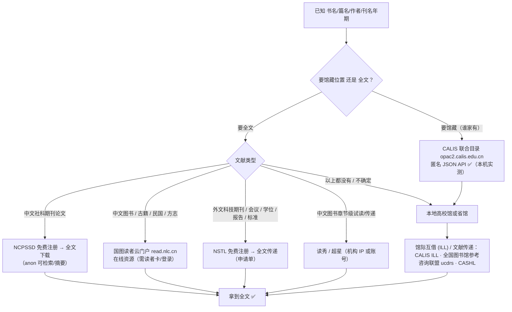

# literature-delivery —— 从书名/篇名到全文的传递路由

- 去哪找：CALIS 联合目录 `https://opac2.calis.edu.cn/`（`http://opac.calis.edu.cn/` 301 至此）；NSTL `https://www.nstl.gov.cn/`；国图读者云门户 `http://read.nlc.cn/user/category`（https 不通）；全国图书馆参考咨询联盟 `http://www.ucdrs.superlib.net/`（仅 http）、新版 `http://www.ucdrs.cn/`；CASHL `https://www.cashl.edu.cn/`；百链 `http://www.blyun.com/`；上海图书馆 `https://www.library.sh.cn/`。
- 什么时候用：手里只有**书名、篇名、作者、ISBN/刊名年期**，要判断「能不能免费或低成本拿到全文 / 藏在哪里」；要**馆藏位置**（谁家有）；要图书章节级试读 / 传递；要外文科技文献原文传递。
- 怎么搜：按「先定位馆藏（CALIS）→ 能自取的自己取（NCPSSD / 国图）→ 拿不到就订（NSTL / ucdrs 原文传递）→ 兜底本地馆馆际互借」四步路由，命中即停；完整流程与逐站实测见「细节」。
- 覆盖：中文图书 / 古籍 / 民国 / 方志 / 期刊 / 学位 / 会议 / 专利 / 标准；外文科技期刊 / 会议 / 学位 / 报告；馆藏定位 + 文献传递 + 馆际互借。
- 门槛：检索 / 目录多可匿名（CALIS、NSTL、国图目录）；**全文下载 / 传递需注册**（NSTL 免费注册、原文传递付费；ucdrs 免费注册后才有检索；国图需读者卡）；百链 IP / 账号墙；CASHL 本机不可达。
- 实测：2026-10-03，macOS 27（arm64），curl 8.x（`-sSk -L -m 20~30`，桌面 Chrome UA，单主机 ≤3 请求、间隔 ≥1.5 s），Python 3.9 stdlib 解析。
- 上游：CALIS 联合目录、NSTL、国图读者云门户、全国图书馆参考咨询联盟、CASHL、百链、上海图书馆（入口 URL 见上）。

> 不适用：只想看**中文期刊论文元数据**（→ [`ncpssd.org.md`](../academic/ncpssd.org.md)、[`cqvip.com.md`](../academic/cqvip.com.md)）；只想**下载单篇 OA 全文**（→ [`paper-search-mcp.md`](../academic/paper-search-mcp.md)、[`paper-lookup.md`](../academic/paper-lookup.md)）。

## 细节

### 一、路由流程（先判类型，再到对应入口；命中即停）



**文字版（按成本从低到高）**

1. **先定位馆藏**：CALIS 联合目录（`opac2.calis.edu.cn`）匿名 API 查书名/作者 → 拿到 `calisid`/`rid` 与收藏馆线索 → 决定走哪个馆的 ILL。
2. **能自己拿的就自己拿**：中文社科论文 → NCPSSD（免费注册下载）；国图在线资源 → 读者云门户（办读者卡 / 远程访问）。
3. **拿不到就订**：NSTL（外文科技类，注册后提交申请单）；全国图书馆参考咨询联盟 ucdrs（中文，需登录后提交传递申请）。
4. **兜底**：本地高校/省馆的馆际互借（CALIS ILL / CASHL 人文社科联盟）——**这条最快也最便宜，但要先有本馆读者身份**。

### 二、逐站实测表（本机 2026-10-03）

| 站点 | 入口（实测） | 检索方式 | 匿名可用 | 门槛 | 状态 |
|---|---|---|---|---|---|
| **CALIS 联合目录** | `http://opac.calis.edu.cn/` → **301** → `https://opac2.calis.edu.cn/` | SPA `/search`；背后 **JSON API**（见 §三） | ✅ **可匿名检索**（JSON，含馆藏线索） | 检索免登录；`/ill` 馆际互借、收藏、导出等写操作需登录（**源码读出**） | ✅ |
| **NSTL 国家科技图书文献中心** | `https://www.nstl.gov.cn/` | `search.html?t=…&q=…`（JS 壳）+ **POST JSON API**（见 [`nstl.gov.cn.md`](../academic/nstl.gov.cn.md)） | ✅ **可匿名检索**（JSON） | **全文传递需注册**（免费个人注册）；机构/全国开通用户可直接下全文 | ✅ |
| **国图读者云门户** | `http://read.nlc.cn/user/category`（**https 不通，用 http**） | 服务端渲染 HTML：`/allSearch/searchList?searchType=…&searchWord=…` | ✅ 检索/目录匿名；**看全文/下载需登录** | 注册/登录 `https://sso1.nlc.cn/sso/userRegist/toRegisteUser`（读者卡）；部分库仅馆内 | ✅ |
| **全国图书馆参考咨询联盟** | `http://www.ucdrs.superlib.net/`（**仅 http，https 000**；无 www 的域名 DNS 无记录） | `book/jour/…` 子域名 + `search?sw=…&channel=…` | ❌ **全站检索 302 → 登录**（首页表单已被替换为「对不起,不能进行检索,请您登录!」） | 免费注册 `http://www.ucdrs.superlib.net/registercheck`；登录后才有检索/文献传递 | ⚠️ 需登录 |
| **图书馆参考咨询联盟（新版）** | `http://www.ucdrs.cn/` | 联盟导航页；检索走成员馆（如广东 `dlib.gdlink.net.cn/login/duxiuquery.action`） | ⚠️ 首页可看；检索跳成员馆登录 | 与上同源；「表单咨询」`xinyunfuwu.com/zxform.do?gid=22&d=…` | ⚠️ |
| **CASHL 开世览文** | `https://www.cashl.edu.cn/`、`http://www.cashl.edu.cn/`、`http://cashl.edu.cn/` | — | ❌ | — | ❌ **本机不可达**：DNS 有 A 记录（162.105.139.118 / 124.205.77.167），但 **20 s 超时 000**，`nc -z` 443/80/8080 全 CLOSED（校园网边界/防火墙，非站点下线） |
| **百链（超星）** | `http://www.blyun.com/` | 登录后检索 | ❌ | 首页直白提示「**您当前的IP不在我们服务的范围内**，请使用账号登录」；支持 CARSI 机构登录 | ❌ IP/账号墙 |
| **上海图书馆** | `https://www.library.sh.cn/` | 门户「服务 → 专业服务」`/service/service/16`，其内条目**「文献传递」**→ `https://z.library.sh.cn/next/resource/serviceGuide/DocumentDelivery` | ⚠️ 门户可看；文献传递页是 SPA | 读者证 | ⚠️ 门户 ✅（200 / 52 KB）；「文献传递」页为 **Vite SPA + `/yit/XYitToken.js`（反爬 token）**，curl 只拿到 587 B 空壳 → **仅浏览器**（本机未取到正文） |
| 国图·文津搜索 | `http://find.nlc.cn/` 200 | `https://find.nlc.cn/search/doSearch?query=…` **000（超时）** | ⚠️ | — | ⚠️ 入口在，https 检索本机不通；`http://opac.nlc.cn/F` 也 000 |

### 三、CALIS 联合目录：匿名 JSON 检索（本机实测可用）

**服务地址**：`serviceHost = https://opac2.calis.edu.cn/prod-api/opac`，检索前缀 `{serviceHost}/codex/ekb/opac`。

**检索（POST，body 为 JSON；`query` 是 CQL 的 base64）**

```bash
BASE='https://opac2.calis.edu.cn/prod-api/opac/codex/ekb/opac'
Q=$(python3 -c 'import base64;print(base64.b64encode("(title=\"基层治理\")".encode()).decode())')
curl -s -m 30 -X POST \
  -H 'Content-Type: application/json;charset=UTF-8' \
  -H 'Referer: https://opac2.calis.edu.cn/search' \
  --data "{\"offset\":0,\"limit\":10,\"query\":\"$Q\",\"sortkey\":\"\",\"lang\":\"zh-cn\"}" \
  "$BASE/bibliography/true/instances/1.0"
```

- 路径模板：`{prefix}/{database}/{true|false}/instances/1.0`；`database=bibliography`（中文图书/联合目录书目；前端把 `ancient` 也映射为 `bibliography`）。第二段 `true` 可检索成功，`false` 对应前端「检索历史重放」分支（**推断，未逐一验证**）。
- **`query` 必须 base64**：明文会 500（实测 `{"message":"Internal Server Error"}`）；base64 后返回 200。
- CQL 字段（实测）：`dc.title` ✅、`dc.creator` ✅（`(dc.creator="陈家刚")` → 49 条）；源码另见 `dc.subject`、`dc.date`、`calis.scanrbClassification`（古籍分类）。
  - `(dc.subject="基层治理")` → **0 条**（该字段可能不索引中文主题词，**存疑勿依赖**）。
- 返回：`{"status":"200","data":{"instances":[…],"resultInfo":{"totalRecords":6,"facets":[…]},…}}`
  - 行字段：`title`、`contributor[].name`（**内含 HTML，需去标签**）、`publisher`、`isbn`、`language`、`type`、`rid`、`calisid`、`resource`（`<a…>无</a>`＝无电子资源）。
  - `resultInfo.facets` 给「数据库/著者」等分面计数（可直接当作者统计）。
- 其他端点（**从打包 JS 读出，未逐个实测**）：`GET {prefix}/{db}/instances/{rid}`（详情）、`GET {prefix}/{db}/marc/{id}`、`GET {prefix}/{db}/marc/download/{id}?marcType=`、`GET {prefix}/{db}/{?}/{?}/search-items`（分面）、`POST {serviceHost}/codex/ekb/opac/ill`（馆际互借，需登录）。
- 人类可读入口：`https://opac2.calis.edu.cn/search?searchType=bibliography&searchField=<title|creator…>&searchWord=<词>`。

**怎么找到这些端点的**（可复用的方法）：SPA 首页只有 `<div id=root>` → 拉 `umi.<hash>.js` → 找 webpack chunk 名映射（`"p__search"` + hash）→ 拉 `p__search.<hash>.async.js` → 找 `"/codex/…"` 字面量 → 在 `vendors.<hash>.async.js` 里找到 `serviceHost:"…/prod-api/opac"` 与方法名（`getSearchData`/`getRecordDetails`/`postIllLoanInfo`）。

### 四、NSTL：匿名检索 + 注册后原文传递

检索 API 细节、字段码、资源类型码见 **[`academic/nstl.gov.cn.md`](../academic/nstl.gov.cn.md)**（本机实测：期刊 `基层治理` 4987 条、学位论文 965 条、图书 `governance` 269 条，全部匿名 200 JSON）。

**全文获取路径**：官网「资源与服务 → 全文获取」（`/Portal/fw_qw.html`）原文口径：
> 「注册用户在 NSTL 网站上检索到的文献资源，可通过**全文传递**方式请求原文传递服务。」申请单未处理时可自行取消；1 个月内未收到可联系热线免费重发。
流程图为 `/img/Portal/sy_qwfw3.png`；配套系统：`https://selfservice.nstl.gov.cn`（用户自助/申请单）、`https://qwwx.nstl.gov.cn/`（全国开通数据库·机构登录）。
**门槛**：个人注册免费；原文传递为**付费**（资费未在公开页列示，本机未验证）；高校/机构常有 NSTL 文献传递补贴。

### 五、全国图书馆参考咨询联盟（ucdrs）：需登录，但是中文图书传递的主力

- **入口**：`http://www.ucdrs.superlib.net/`（**只能 http**；`https://www.ucdrs.superlib.net/` → 000，TLS 握手失败；裸域 `ucdrs.superlib.net` 无 DNS 记录）。
- **分类型检索 URL 模板**（子域名 + 通道名，取自站内 `alltopmenu.js`）：

| 类型 | 通道参数 | 检索 URL 模板 |
|---|---|---|
| 图书 | `search` | `http://book.ucdrs.superlib.net/search?sw=<词>&channel=search&Field=1&sType=0` |
| 期刊 | `searchJour` | `http://jour.ucdrs.superlib.net/search?sw=<词>&channel=searchJour&Field=1&sType=0` |
| 报纸 | `searchNP` | `http://newspaper.ucdrs.superlib.net/search?sw=<词>&channel=searchNP&Field=1&sType=0` |
| 学位论文 | `searchThesis` | `http://book.ucdrs.superlib.net/search?sw=<词>&channel=searchThesis` |
| 会议论文 | `searchCP` | `…channel=searchCP` |
| 专利 / 标准 | `searchPatent` / `searchStd` | `…channel=searchPatent` / `…channel=searchStd` |
| 音视频 / 科技报告 | `searchVideo` / `searchScReport` | `…channel=searchVideo` / `…channel=searchScReport` |
| 知识（百科式） | `goqw.jsp` | `http://www.ucdrs.superlib.net/goqw.jsp` |

  （仅**图书 / 期刊**两条 URL 本机实测；其余通道名来自 JS，**未逐条 curl 验证**。）
- **实测现象**：图书、期刊两条检索 URL 均 **302 → `http://www.ucdrs.superlib.net/login/duxiuquery.action?enc=UTF-8&backurl=<原URL>`**；首页检索表单已被替换为 `action="/msgback"` 且隐藏字段写明 `msg=对不起,不能进行检索,请您登录!` → **匿名拿不到结果页**。
- **注册**：`http://www.ucdrs.superlib.net/registercheck`（免费；首页提示登录）。
- **文献传递提交方式**：登录后检索 → 条目页「文献传递 / 咨询」；或走联盟「表单咨询」表单 `http://www.xinyunfuwu.com/zxform.do?gid=22&d=<会话签名>`（`d` 为每次会话生成，**不能硬编码**）。**结论：全流程需登录，且需按页面提示填写；无公开 API。**
- **新版联盟导航**：`http://www.ucdrs.cn/`（「图书馆参考咨询联盟」，各成员馆咨询台入口：山东省图/江苏省图/广东省立中山图书馆…），其检索表单直接跳成员馆（如 `http://dlib.gdlink.net.cn/login/duxiuquery.action`、期刊 `http://jour.gdlink.net.cn/advsearchmag.jsp`），同样需登录。

### 六、国图读者云门户（read.nlc.cn）：书目/特色资源检索的免费入口

- **入口**：`http://read.nlc.cn/user/category`（**https 不通 → 000；必须 http**），标题《读者云门户》。
- **检索 URL**（服务端渲染，匿名可看目录）：
  `http://read.nlc.cn/allSearch/searchList?searchType=<类型码>&showType=1&pageNo=<页>&searchWord=<词>[&classification=<中图类>]`
  实测 `searchType=1&searchWord=基层治理` → 200 / 30 KB / 服务端渲染，内联 JS 给出 `pageTotal='45'`、`pageSize='12'`；分面 `classification=A/B/C/D…` 带计数（`D 政治、法律 (1033)`）。
- **详情页模板**：`http://read.nlc.cn/allSearch/searchDetail?searchType=1&showType=1&indexName=data_402&fid=<fid>`。
- **类型码表**（从页面链接实测提取，常用项）：`1` 电子图书(=中文图书)、`65` 博士论文、`24` 民国图书、`35` 民国期刊、`60` 民国报纸、`61` 民国法律、`12` 数字方志、`43` 地方志、`10024` 数字古籍、`10026` 普通古籍、`10021` 赵城金藏、`28/42/…` 家谱与地方馆特色资源、`14` 哈佛大学善本特藏、`10022` 法藏敦煌遗书、`62` 中华古籍善本联合书目。
- **门槛**：检索/目录匿名 ✅；**看全文/下载需登录** → 注册 `https://sso1.nlc.cn/sso/userRegist/toRegisteUser`（国图统一认证）；大量资源仍限馆内或需读者卡权限。

### 实测

2026-10-03，macOS 27（arm64），curl 8.x（`-sSk -L -m 20~30`，桌面 Chrome UA，单主机 ≤3 请求、间隔 ≥1.5 s），Python 3.9 stdlib 解析。逐条观测：

**全国图书馆参考咨询联盟**
- `http://www.ucdrs.superlib.net/` → **200 / 6707 B**，`<title>全国图书馆参考咨询联盟</title>`；`https://www.ucdrs.superlib.net/` → **000**；`ucdrs.superlib.net`（无 www）→ **DNS 无记录**
- `http://book.ucdrs.superlib.net/search?sw=基层治理&channel=search&Field=1&sType=0` → **302**，`Location: http://www.ucdrs.superlib.net/login/duxiuquery.action?enc=UTF-8&backurl=…`
- `http://jour.ucdrs.superlib.net/search?sw=基层治理&channel=searchJour&Field=1&sType=0` → **302**（同上）
- 首页检索表单：`<form name=f2 action="/msgback" method=get>` + 隐藏字段 `msg="对不起,不能进行检索,请您登录!"`（= 表单已被替换为登录提示）
- `http://www.ucdrs.cn/` → **200 / 21813 B**，`<title>图书馆参考咨询联盟</title>`

**CALIS**
- `http://opac.calis.edu.cn/` → **301** → `https://opac2.calis.edu.cn/`
- `https://opac2.calis.edu.cn/` → **200 / 1400 B**，`<title>CALIS联合目录公共检索系统</title>`（`<div id=root>` + `umi.644648eb.js`）
- `POST …/codex/ekb/opac/bibliography/true/instances/1.0`（`(title="基层治理")` 的 base64）→ **200 / 11668 B**，`status=200`、`totalRecords=6`、`instances` 6 行
- 明文 query（非 base64）→ **500 Internal Server Error**；`(dc.creator="陈家刚")` → **49**；`(dc.subject="基层治理")` → **0**

**NSTL**（详见 [`academic/nstl.gov.cn.md`](../academic/nstl.gov.cn.md)）
- `https://www.nstl.gov.cn/` → **200 / 117028 B**；检索接口 `paper/pc/list/pl` → **200 JSON**，`基层治理` 期刊 **4987** / 学位 **965** / 会议 **11**，`governance` 图书 **269**

**国图 / 其他**
- `http://read.nlc.cn/user/category` → **200 / 25830 B**，`<title>读者云门户</title>`；`https://read.nlc.cn/` → **000**
- `http://read.nlc.cn/allSearch/searchList?searchType=1&showType=1&pageNo=1&searchWord=基层治理` → **200 / 30049 B**，服务端渲染，内联 `pageTotal='45'`、`pageSize='12'`
- `http://www.blyun.com/` → **200 / 18028 B**，页面正文「对不起，您当前的IP不在我们服务的范围内，请使用账号进行登录。」
- `https://www.library.sh.cn/` → **200 / 67023 B**；`/service/service/16`（专业服务）→ 200 / 52 KB，其数据含 `"文献传递"` → `https://z.library.sh.cn/next/resource/serviceGuide/DocumentDelivery` → **200 / 587 B 空壳**（Vite SPA）
- **CASHL**：`https://www.cashl.edu.cn/`、`http://www.cashl.edu.cn/`、`http://cashl.edu.cn/` 均 **000 / 20.00 s 超时**；`nc -z -G 5` 测 `www.cashl.edu.cn:443/80/8080`、`cashl.edu.cn:443` → **全 CLOSED**；`nslookup` 有 A 记录 → 判为**本机网络边界受限**，非站点下线
- `http://find.nlc.cn/` → **200 / 8210 B**；`https://find.nlc.cn/search/doSearch?query=基层治理` → **000**；`http://opac.nlc.cn/F` → **000**

本文 `✅/⚠️/❌` 均取自当日本机请求；标「源码读出」「上游口径」「推断」「未验证」者未做端到端复现，用前先自行探测。

## 坑

- **http/https 混用**：`ucdrs.superlib.net`、`read.nlc.cn` 都**只有 http 通**（https 超时/握手失败）；照抄模板时别自作主张换 https。
- **域名变体**：`www.ucdrs.superlib.net` 通、`ucdrs.superlib.net`（无 `www.`）**DNS 无记录** → **必须带 `www.`**；老入口 `opac.calis.edu.cn` 已 301 到 `opac2.calis.edu.cn`。
- **`query` 必须 base64**（CALIS）；CALIS 返回的 `contributor[].name` 是**带 `<a onClick=…>` 的 HTML 片段**，解析必须去标签。
- **不要硬编码会话参数**：ucdrs 的 `zxform.do?d=…`、NSTL 的 `searchId`（`md5(searchWordId+_tk+时间戳+NCookie)`）都是会话级；NSTL 检索**不带**这些也返回 200（本机实测），别照抄 JS 里的签名逻辑。
- **CASHL 本机不通 → 不代表站点下线**：DNS 正常、TCP 被丢包，属网络边界问题；需要时换网络/代理重探，或先走 CALIS ILL。
- **「免费」的真实含义**：联盟/中心的**检索与目录**免费；**全文传递**通常需注册，费用由个人或所属机构承担（NSTL 为付费，高校多有补贴）。写结论时把「检索可达」与「全文可拿」分开说。
- 礼貌值：单主机 ≤3 请求、间隔 ≥1.5 s、桌面 UA、`-m 20~30`（本卡所有实测遵守）。
